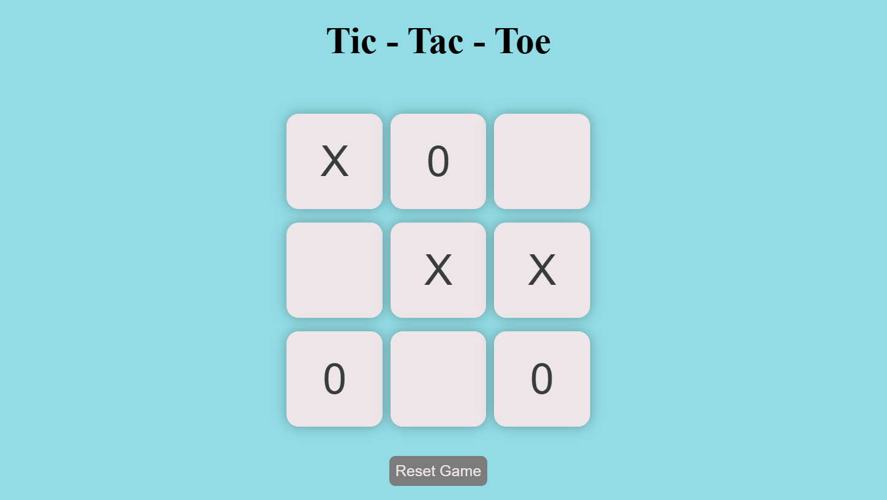
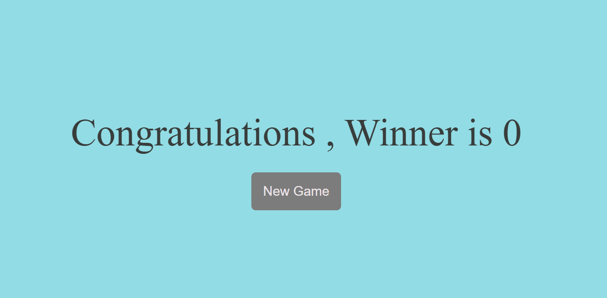

# 🎮 Tic Tac Toe Game

 A simple Tic Tac Toe game built using HTML, CSS, and JavaScript. It's a two-player game where you can play as X or O. I made it to practice DOM manipulation and basic game logic. It also detects wins, draws, and has a reset button.

---

## 🔗 Live Demo

🌐 [Click here to play the game](http://127.0.0.1:5500/index.html)

---

## 📸 Screenshots

| Game Start | Game Win |
|------------|----------|
|  |  |

---

## ✨ Features

- 🎨 Clean and intuitive UI
- 🖥️ Responsive design
- 🔁 Restart the game anytime
- ⚔️ 2-player mode
- ❌⭕ Instant win/draw detection

---

## 🛠️ Built With

- ✅ HTML5
- ✅ CSS3
- ✅ JavaScript (Vanilla)

---

## 🚀 Getting Started

Follow these steps to run the project locally:

```bash
git clone https://github.com/parbezalam590/tictactoe.git
cd tictactoe
open index.html in your browser
